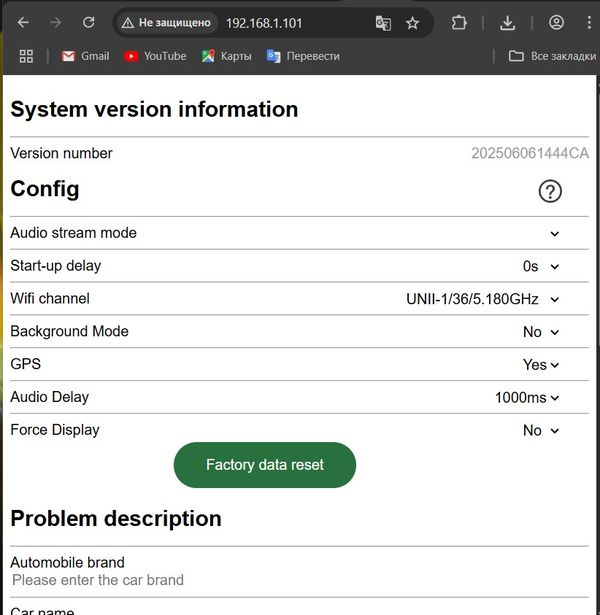

## Firmware Downloader for Tina Project Allwinner v851se (RM-SQ1M)
Набор слов с Aliexpress: Carplay Android Auto USB Car Dongle Plug&Play CarPlay AI Box BT WiFi для проводных автомобилей CarPlay/Andriod Auto

<span style="color:red; font-size:24px;">Внимание!</span><br>
<span style="color:red; font-size:24px;">Все манипуляции по прошивке Вы проводите на свой страх и риск.</span><br>
<span style="color:red; font-size:24px;">Владельцы репозитория не несут ответственности за окирпичивание девайсов.</span>

## Внешний вид адаптера
## Внешний вид адаптера

<div style="display: flex; flex-wrap: wrap; gap: 10px;">
  
  
  
  
</div>

## Описание адаптера
* На самом адаптере нет обозначения модели, бренда, версии
* На коробке указано `RM-SQ1M` и по этому названию его можно найти
* Процессор `Allwinner v851se`
* Так же есть упоминание `Tina Project` (разработчик?)
* В настройках присутствует только `5GHz Wi-Fi`

<div style="display: flex; flex-wrap: wrap; gap: 10px;">
  
  
</div>


## Обновление адаптера через скрипт
* Качаем папку `FirmwareDownloader`
* Там два скрипта PowerShell-скрипт (.ps1) и VBScript (.vbs)
* (!) Возможно будет проблема с запуском скрипта из-за запрета в windows
	* Чтобы разрешить запуск PowerShell-скриптов (.ps1), нужно изменить политику выполнения (Execution Policy). 
	* Запускаем от имени администратора PowerShell и вводим команду:
	  ```
	  Set-ExecutionPolicy RemoteSigned -Scope CurrentUser
      ```
* После этого можно запускать `LaunchGUI.vbs` - это скрипт который просто запускает `downloader_script.ps1` без дополнительных манипуляций в консоли.
* Открывается окно GUI интерфейса
* Жмем `Check`
* Если прошивка есть, то напишет `new firmware version` и разблочится кнопка `Download`
* Жмем `Download`, в окне консоли PowerShell отобразится загрузка файла
* По окончанию загрузки будет выведено сообщение с указанием куда файл сохранен (стандартная папка `Downloads`)
* Дальше нужно зайти в папку на самом девайсе `Этот компьютер\Android765\Tina存储设备\swupdate`
  
* Кидаем туда скаченный файл прошивки `se_202506061444.swu`
* Отключаем устройство
* Включаем устройство
* Должна начаться установка прошивки. Какой-то индикации этого процесса я не заметил
* Просто ждем когда подключится/определится в windows
* Прошивка окончена
* После этого можно ещё раз зайти в папку `swupdate`, проверить что там уже пусто

## Обновление адаптера без скрипта
* (!) Нужен ноутбук с wifi и возможностью получить интернет по LAN (или другим дополнительным способом, например телефон в режиме модема)
* (!) Нужно на сопряженных с устройством смартфонах отключить bluetooth, иначе они постоянно будут коннектиться и мешать
* Подключаем устройство к ноутбуку
* После того как оно включится коннектимся к нему по wifi
* Точка доступа будет называться в стиле: `Smartbox-XXXX`
* Пароль к ней: `12345678`
* Далее нужно подключиться по кабелю к интернету (LAN)
* После этого заходим в браузер вбиваем адрес `192.168.1.101`
* Получаем страницу с опциями всякими
* В самом верху будет версия прошивки `Version Number: 202412250946CA`
* Крутим в самый низ, там раздел `Online updates`
* Если обновлений нет (или нет интернета), то прошивок не будет: `Already the latest version`
* Если интернет есть и обновления тоже есть, то будет надпись `A new version is available for upgrade`
* Появится выпадающее меню `Please select a software version`
* В нем надо выбрать новую прошивку, например `se_202506061444.swu`
* И затем нажать кнопку `upgrade`
* Ждать завершения процесса

## Для других адаптеров со схожим интерфейсом
* Если по адресу `192.168.1.101` у вас похожий интерфейс, диск называется типа `Tina存储设备`, то можно попробовать получить нужные данные и подправить скрипт
* Но данный кейс не проверялся на других устройствах
* Подключаем устройство к ноутбуку
* Переходим в папку `Этот компьютер\Android765\Tina存储设备\log`
* Открываем любой файл вида `sdsdk_Х.log`
* В нем я нашел пароль от wifi в виде строки `ssid=Smartbox-XXXX passwd=12345678`
* Если пароля нет, то можно попробовать подобрать, он будет состоять из 8 цифр, например ещё один популярный пароль: `88888888`
* Подключаемся по wifi к устройству
* Переходим по ссылке http://192.168.1.101/cgi-bin/getversion.cgi
  * Тут в самом низу получаем необходимые данные
    ```properties
    custom:leshida
    platform:v851se
    ```
* После этого можно подредактировать скрипт на получение прошивки для своего устройства
* Найдите в `downloader_script.ps1` строку
	```
	-Body '{"version":"","platform":"v851se","custom":"leshida"}'
	```
* Замените на свои значения `custom` и `platform`
* Значение `version` должно оставаться пустым
* Теперь можно переходить к [Обновление адаптера через скрипт](#обновление-адаптера-через-скрипт)

